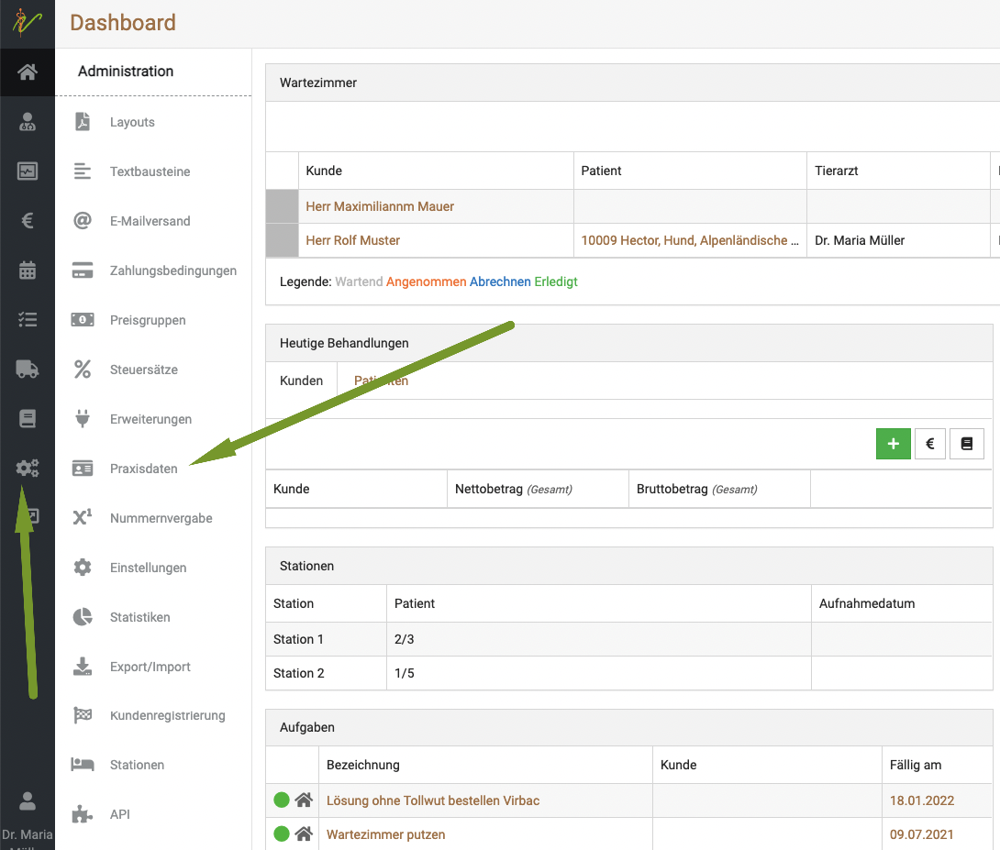
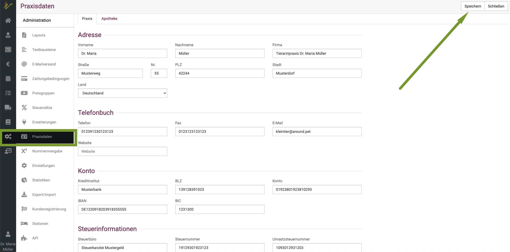

# Erste Schritte mit Debevet  

Dieser Abschnitt hilft Ihnen, die 5 wichtigsten Schritte zur ersten Nutzung von debevet zu gehen. 

## 1. Eigene Praxisdaten inkl. Logo anlegen   

Damit auf Ihren Rechnungen/Briefen etc. Ihre Kontodaten und alle weiteren Daten korrekt hinterlegt sind (im Fußteil), müssen Sie diese 
zunächst hinterlegen. Klicken Sie dafür am linken Bildrand auf das Zahnradsymbol und dann auf "Praxisdaten".  

    

Hier tragen Sie nun alle Ihre Daten ein und klicken dann oben rechts auf "Speichern".  
  
  

Die Hinterlegung eines Logos ist im debevet evtl. anders, als Sie es von anderen Programmen kennen. Sie hinterlegen nicht nur das Logo, sondern ein Briefpapier.
Wir helfen Ihnen bei Bedarf gern dabei, eine Anleitung dazu finden Sie hier: 

[Logo/Hintergrund anlegen](/docs/Administration/Layouts#2-hintergrund)  

## 2. Kunden und Patienten anlegen    

Der nächste wichtige Punkt ist es, Kunden (also Patientenbesitzer) und deren Patienten (also Tiere) anzulegen. 

Die Anleitung zu der Verwaltung der Kunden in debevet finden Sie hier:  

[Kundenverwaltung debevet](/docs/Kunden/Kunden_in_debevet)

Die Patientenverwaltung finden Sie hier:  

[Patientenverwaltung debevet](/docs/Patienten/Patienten_in_debevet)

## 3. Kataloge importieren   
n
Wir bieten mit debevet die einfache Möglichkeit, diverse Kataloge (z.B. die GOT) zu importieren, um direkt alle nötigen Preise und Dienstleistungen
nutzen und abrechnen zu können. Eine einfache Schritt-für-Schritt Anleitung finden Sie hier:  

[Kataloge importieren](/docs/Warenwirtschaft/Kataloge)

## 4. Produkte anlegen  

Als "Produkt" bezeichnet die debevet Software alles, was in Rechnung gestelt werden kann. 
Neben Medikamenten/Marterial, Futter zählen hierzu auch die Dienstleistungen.   
Neben dem Import von Katalogen können Sie auch individuelle Produkte/Dienstleistungen erstellen. Die Anleitung finden Sie hier:  

[Produkte verwalten](/docs/Warenwirtschaft/Produkte)  

## 5. Patienten behandeln und abrechnen

Natürlich ist das Wichtigste in Ihrer alltäglichen Praxis, Patienten zu behandeln und die Behandlungen an den Patienten abzurechnen. 
Wie dies geht, lernen Sie hier:

[Patienten behandeln](/docs/Patienten/Behandlung)

[Patienten abrechnen](/docs/Patienten/Patienten_abrechnen)

